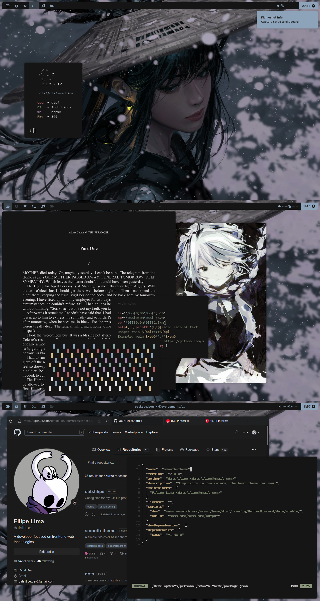

# Personal dots

Just started using bspwm + fish. Also very soon I will start using neovim.

## Description

<ul align="left">
  <li><strong>WM</strong>: <a href="https://github.com/baskerville/bspwm">Bspwm</a></li>
  <li><strong>OS</strong>: Arch Linux</li>
  <li><strong>SHELL</strong>: Fish</li>
  <li><strong>Terminal</strong>: Kitty</li>
  <li><strong>File Manager</strong>: Ranger</li>
</ul>

## Preview

</img>

## Credits

- Inspired / took some stuff from: [here](https://www.reddit.com/r/unixporn/comments/sdfpj7/bspwm_trying_new_colorscheme/), [here](https://www.reddit.com/r/unixporn/comments/qhhbrc/bspwm_the_gardeners_love/) and [here](https://www.reddit.com/r/unixporn/comments/sak598/yabai_catppuccin_is_taking_over_and_i_love_it/).
